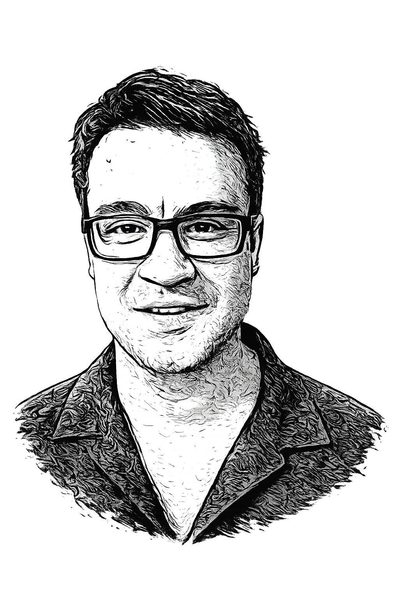

::: {.landing-page}

::: {.hero-grid}

::: {.hero-text}

# Gabriel Frazer-McKee

## PhD candidate in linguistics at Université Laval

::: {.social-row}
[](https://github.com/gafrm)
[](https://orcid.org/0000-0002-0860-6192)
[](https://www.researchgate.net/profile/Gabriel-Frazer-Mckee)
[](https://www.linkedin.com/in/gabriel-frazer-mckee-401586220/)
[](https://scholar.google.com/citations?hl=en&user=MWAQth4AAAAJ)
[](mailto:gabriel.frazer.mckee@gmail.com)
:::

I study neology, lexical diffusion, corpus linguistics, lexicography, and methods for synthesizing linguistic evidence. My doctoral work examines the linguistic and extralinguistic factors associated with the diffusion and non-diffusion of new words.

[Learn more about me →](about.qmd){.learn-more}

:::

::: {.hero-graphic}
{.hero-image}
:::

:::

:::

::: {.news-bottom}

## Recent news

::: {#recent-news}
:::

:::

