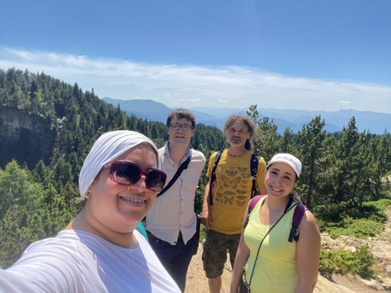

*Originally written as a letter of thanks to the anonymous donor whose support made this short research stay possible.*

Dear donor,

During the COVID-19 pandemic, the expression *Zoom apéros* — or “Zoom happy hours” — quickly became part of everyday life, referring to virtual gatherings with friends that tried to make up for the absence of shared moments in person. The fact that both the expression and the practice largely disappeared after lockdowns were lifted says something important: nothing truly replaces the richness and ease of face-to-face exchange. Thanks to your generous support, I was able to experience this firsthand.

The travel award gave me the freedom to travel to Grenoble, France, for a training stay in June, where I met my research co-supervisor in person for the very first time. My meetings with Olivier, a computer science specialist at Université Grenoble Alpes, helped us develop a genuine working relationship, one that will support a lasting collaboration. They also opened up new avenues of reflection that no video call could have sparked in quite the same way.

I also have wonderful personal memories of the stay, including discovering *sérac*, a fresh cheese from the foothills of the French Alps, which I warmly recommend to anyone visiting the region.

I am therefore deeply grateful for your commitment to supporting emerging researchers, and for making my first in-person meetings with my co-supervisor possible.

With sincere gratitude,

Gabriel Frazer-McKee
SSHRC Doctoral Fellow in Linguistics
Specialist in neology in Quebec French
Université Laval

{fig-alt="Group photo from an excursion to Chamrousse, in the French Alps." width="100%"}
*Memory from an excursion to Chamrousse, in the French Alps, with my co-supervisor Olivier and my fellow doctoral students Rim and Ola, after a productive week of work in Grenoble. The fresh mountain air offered a welcome contrast to the stifling heat of the city, aptly nicknamed “the Bowl.”*

<!--Include social share buttons-->


